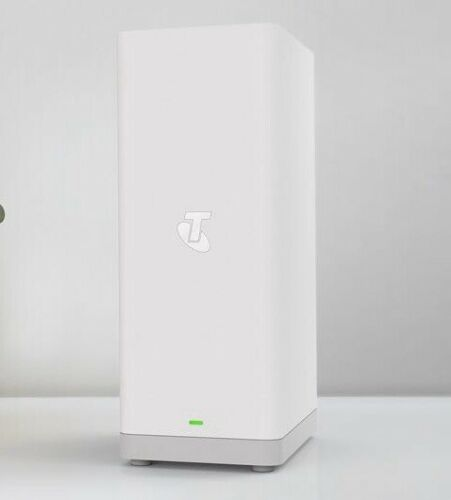

# DJA0231 Stats (1.0.1)


# About
I got a bit grumpy with $BIGTelco not exposing modem stats via something reasonable, so I decided to do it myself.

This pulls mobile, system, wireless and interface data using [OpenWRT ubus](https://openwrt.org/docs/techref/ubus) and pushes it to stdout/AWS MQTT to be consumed by other applications. This format is compatable with [Kirby Transform](https://github.com/SrzStephen/Kirby-Transform)


 An example of what this data looks like is available in ```docs/data.json```.

# Usage
## Base
```make install``` and then run ```ModemStats```.
the base ```modem_stats``` command does nothing and will just print help, use subcommands ```mqtt``` and ```stdout``` to do something useful.
```zsh
root@mymodem: ./modem_stats --help
ModemData 1.0.1
Stephen Mott
Pull stats from DJA0231 (and possibly other openWRT modems) and send to mqtt/stdout

USAGE:
    modem_stats [SUBCOMMAND]

FLAGS:
    -h, --help       Prints help information
    -V, --version    Prints version information

SUBCOMMANDS:
    help      Prints this message or the help of the given subcommand(s)
    mqtt      Prints data to AWS MQTT
    stdout    Prints data to stdout
```

## mqtt
Pushes the data to a MQTT broker. Verify that it works with something like [MQTT.fx](https://mqttfx.jensd.de/).

Create your AWS IoT certificates either [through the console or via the CLI](https://docs.aws.amazon.com/iot/latest/developerguide/device-certs-create.html). Make sure to also download [Amazons Root CA](https://www.amazontrust.com/repository/AmazonRootCA1.pem)
```zsh
root@mymodem: ./modem_stats mqtt --help
modem_stats-mqtt 0.0.1
Stephen Mott
Prints data to AWS MQTT

USAGE:
    modem_stats mqtt [OPTIONS] --path_to_device_cert <device_cert> --path_to_private_key <device_private_key> --aws_endpoint_url <endpoint_url> --path_to_cert <path_to_cert>

FLAGS:
    -h, --help       Prints help information
    -V, --version    Prints version information

OPTIONS:
        --client_id <client_id>                       AWS client ID [default: ModemMQTT]
        --path_to_device_cert <device_cert>           Path to device certificate [default: ]
        --path_to_private_key <device_private_key>    Path to device private key [default: ]
        --aws_endpoint_url <endpoint_url>             Path to AWS MQTT URL [default: ]
        --path_to_cert <path_to_cert>                 Path to AWS root CA [default: ]
    -p, --period <period>                             seconds between printing [default: 30]
        --mqtt_topic <topic>                          AWS MQTT topic [default: /private/modem/]
```

Minimal usage looks like this
```
./modem_stats mqtt --path_to_cert=certs/AmazonRootCA1.pem \
--path_to_device_cert=certs/XXXX-certificate.pem.crt \
--path_to_private_key=certs/XXXX-private.pem.key \
--aws_endpoint_url=XXXX-ats.iot.us-east-1.amazonaws.com
```

## stdout
```zsh
root@mymodem:./modem_stats stdout --help
modem_stats-stdout 0.0.1
Stephen Mott
Prints data to stdout

USAGE:
    modem_stats stdout [FLAGS] [OPTIONS]

FLAGS:
    -c, --continue    Continously print
    -h, --help        Prints help information
    -V, --version     Prints version information

OPTIONS:
    -p, --period <period>    seconds between printing [default: 30]
```

# Running.
## Modem setup
The fun police don't let you have root access by default, have a look at [technicolor hacks](https://hack-technicolor.readthedocs.io/en/stable/) to figure out how to root your firmware version.


## Development
Install rust with
```curl --proto '=https' --tlsv1.2 -sSf https://sh.rustup.rs | sh```
Run with 
```cargo run stdout --help``` to check that everything is working properly.

## Release
Cross compiling this thing can be a bit awkward, but compiling on the modem iself isn't really a good option. The modem uses a dual core Amv7 CPU with *very* limited instruction sets.
```
root@mymodem:~# cat /proc/cpuinfo 
processor	: 0
model name	: ARMv7 Processor rev 1 (v7l)
BogoMIPS	: 398.13
Features	: half thumb fastmult edsp tls 
```

I'd suggest using a Raspberry Pi V4 so that you're at least on the same architecture as the modem that you're trying to compile to.

Because of the limited instruction sets, you'll need to avoid hardware floating point instructions as it'll try to build with ```VFPv3``` which will cause an ```illegal instruction``` error.
Install your target architecture and required tools with
```zsh
rustup target add armv7-unknown-linux-musleabi
cargo install cross
sudo apt install -y musl-tools
```

The actual build command is based on the one that [growse has documented](https://www.growse.com/2020/04/26/adventures-in-rust-and-cross-compilation-for-the-raspberry-pi.html) with a few differences
* CFLAGS="-mfloat-abi=softfp" to ensure that software floating point calculations were used to avoid any instructions that don't exist on the modem
* a build target of target armv7-unknown-linux-musleabi instead of target armv7-unknown-linux-musleabihf (the hf -> hardware floating)
```
make release
```
And you should now be able to copy this binary over to the modem and run it. make sure to ```chmod +x``` it to make it executable.


# TODOs
Since this is a WIP made very quickly, there's still a few todos.

* Make it run on startup with ```init.d```.
* CI pipeline

# Why though?
It seemed like a good idea at the time.


I wanted to avoid making a web scraper because that sounded lame, I wanted to avoid exposing ubus using uHTTPd or trying to modify the existing nginx configs on the device to avoid problems when updating.

I'm trying to standardise my IoT stuff around AWS MQTT since the [free tier](https://aws.amazon.com/free/) is pretty generous for Lambda and IoT. It shouldn't be too difficult to move off of AWS if this changes in the future.

I chose Rust even though I've never written in it before because it sounded like fun, sounded like it had decent cross compilation support and [Rico](https://twitter.com/ricobeti?lang=en) keeps harping on about it.
